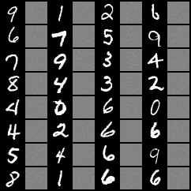

## Variational Autoencoder (VAE)

## Decoder Reconstruction Evolution

<table>
  <tr>
    <td align="center">
      Vanilla VAE Decoder Reconstruction - training set (MNIST)
    </td>
  </tr>
  <tr>
    <td align="center">
      
    </td>
  </tr>
</table>

## Sources
- Auto-Encoding Variational Bayes [Diederik P Kingma, Max Welling. 2013](https://arxiv.org/pdf/1312.6114)
- $\beta$-VAE: Learning Basic Visual Concepts with a Constrained Variational Framework, [Irina Higgins, Loic Matthey, Arka Pal, Christopher Burgess, Xavier Glorot, Matthew Botvinick, Shakir Mohamed, and Alexander Lerchner 2017](https://openreview.net/pdf?id=Sy2fzU9gl)
