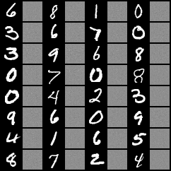
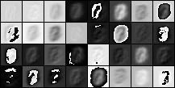
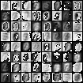
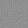
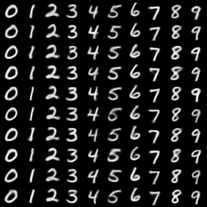
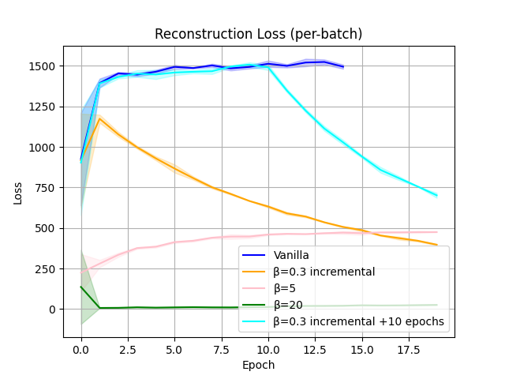

# Variational Autoencoder (VAE)

## Training Evolution (MNIST)

<table>
  <tr>
    <td align="center">
    </td>
    <td align="center">
      Decoder Reconstruction - Training Set
    </td>
    <td align="center">
      Decoder Reconstruction - Validation Set
    </td>
    <td align="center">
      Convolutional Layers Output - Encoder
    </td>
    <td align="center">
      Convolutional Layers Output - Decoder
    </td>
  </tr>
  
  <tr>
    <td align="center">
      Vanilla VAE
    </td>
    <td align="center">
      
    </td>
    <td align="center">
      
    </td>
    <td align="center">
      
      
    </td>
    <td align="center">
      
      
    </td>
  </tr>

  <tr>
    <td align="center">
      $\beta$-VAE (0.3 $\beta$ incremental)
    <td align="center">
      
    </td>
    <td align="center">
      
    </td>
    <td align="center">
      
      
    </td>
    <td align="center">
      
      
    </td>
  </tr>

  <!--
  <tr>
    <td align="center">
      β-VAE
    </td>
  </tr>
  -->
</table>

<table>
  <tr>
      <td align="center">
      </td>
      <td align="center">
          Samples from Inference $\mathbf{z} \sim \mathcal{N}(0, \boldsymbol{I})$
      </td>
      <td align="center">
          Samples from Inference (per-class) $\mathbf{z} \sim \mathcal{N}(\boldsymbol{\mu}_{\text{class}}, \boldsymbol{\sigma}_{\text{class}})$
      </td>
      <td align="center">
          3D Principal Component Analysis on $\mathbf{z}$ ($\mathbf{\mu_z}$) $\mathbf{z}\in\mathbb{R}^{70}$
      </td>
  </tr>
  
  <tr>
    <td align="center">
      Vanilla VAE
    </td>
    <td align="center">
      
    </td>
    <td align="center">
      
    </td>
    <td align="center">
      
    </td>
  </tr>

  <tr>
    <td align="center">
      $\beta$-VAE (0.3 $\beta$ incremental)
    </td>
    <td align="center">
      
    </td>
    <td align="center">
      
    </td>
    <td align="center">
    </td>
  </tr>

  <tr>
    <td align="center">
      $\beta$-VAE (0.3 $\beta$ incremental +10 epochs)
    </td>
    <td align="center">
      
    </td>
    <td align="center">
      
    </td>
    <td align="center">
    </td>
  </tr>
  
</table>

<table>
  <tr>
    <td align="center">
      Reconstruction Loss
    </td>
    <td align="center">
      KL Divergence
    </td>
  </tr>

  <tr>
    <td align="center">
      
    </td>
    <td align="center">
      
    </td>
  </tr>
</table>

<table>
  <tr>
    <td align="center">
        Image sampling transition $\beta$-VAE
    </td>
  </tr>
  <tr>
    <td align="center">
      
    </td>
  </tr>
</table>

## Sources
- Auto-Encoding Variational Bayes [Diederik P Kingma, Max Welling. 2013](https://arxiv.org/pdf/1312.6114)
- $\beta$-VAE: Learning Basic Visual Concepts with a Constrained Variational Framework, [Irina Higgins, Loic Matthey, Arka Pal, Christopher Burgess, Xavier Glorot, Matthew Botvinick, Shakir Mohamed, and Alexander Lerchner 2017](https://openreview.net/pdf?id=Sy2fzU9gl)
